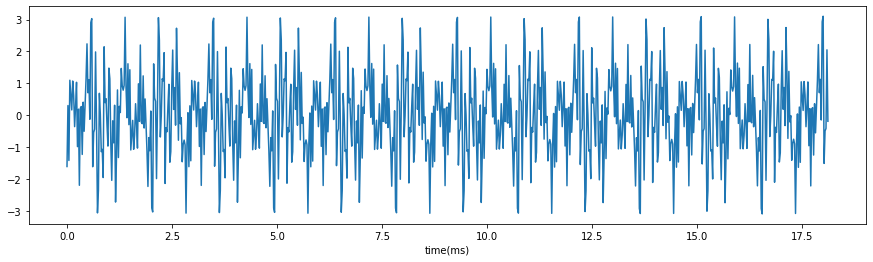
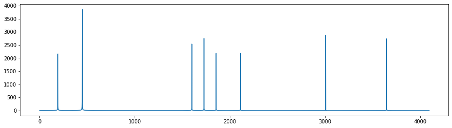

***********************************************
FIR filter implementation and simulation
***********************************************

Introduction
=======================
For those who are already familiar with FPGA design, you can optionally do this project to implement a FIR filter with VHDL.

In this project you are required to design a FIR filter and simulate it in the Vivado. You have to finish the code in ./Src/FIR.vhd and get the simulation running. 

Note: Don't ask question before Googling, if you cannot figure the provided code out, please follow the four labs in the main site.

Procedures
=================

In ./Src/stimuli.txt is a time domain signal with 8 frequency components sampled at the frequency of 100kHz.

The following figure is the spectrum of the signal in stimuli. There are 8 frequency components in it.

You have to design a low pass FIR filter to remove six frequency components with higher frequencies.

After you design FIR filter coefficients in python or matlab, you are required to implement a FIR filter with VHDL code and complete the ./Src/FIR.vhd. A testbench is provided for you to simulate your code in Vivado.

On March 27th, you have to submit a report with the screenshot of the simulation. The lab report has to include the following sections:

     * Introduction
     * procedures
     * Results
     * Discussion/Conclusion
     * Reference
     * Appendix(code and screenshots)